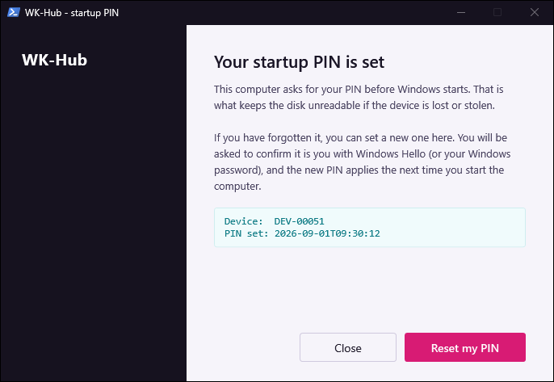
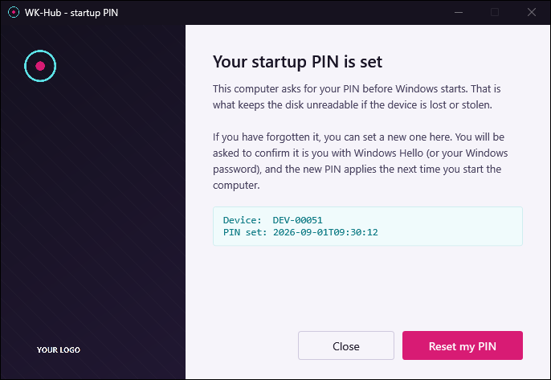

# Branding

The app draws four windows:

- the **PIN dialog**;
- the **notice**, for states the user cannot fix, such as a drive that is not
  encrypted;
- the **manage window**, the self-service landing page ("Your startup PIN is
  set", with **Reset my PIN**) — same layout and branding slots as the notice;
- the **password prompt**, shown only when Windows Hello cannot run.

The first three draw a dark **rail** down the left side. That rail is where your
branding goes: a wallpaper image behind it, a logo mark at the top, and a
wordmark at the foot. The password prompt has no rail — a light body and the
window icon only.

There is also a small "Waiting for Windows Hello..." window, drawn in the user's
own session for the Hello prompt to sit in front of. It is deliberately
unbranded: plain near-black with white text, and it takes no artwork.

Branding is a **drop-in, never a dependency**. Supply artwork and it is staged and
used automatically. Supply none and the windows fall back to a text wordmark on a
solid colour — same layout, same behaviour, and it looks deliberate rather than
broken.

| No artwork (default) | With the three PNGs |
|---|---|
|  |  |
|  |  |

A missing image can never stop the dialog, or any of the other windows,
appearing. WPF resolves `<Image Source="…"/>` while the XAML is being *parsed*,
so a path that does not exist throws out of `XamlReader.Load` and takes the whole
window down. The markup for an image is therefore only emitted when the file is
actually on disk — an element that is never written cannot fail to load.

---

## The three files

Drop them next to the scripts, under **exactly** these names. Any of the three
can be omitted independently.

| File | Where it appears | Size | Format |
|---|---|---|---|
| `brand-logo-square.png` | window icon (all four windows), and the mark at the top of the rail | **256 × 256** | PNG, transparent background |
| `brand-logo-on-dark.png` | wordmark at the foot of the rail | **~600 × 160** | PNG, transparent, must read on a *dark* backdrop |
| `brand-background.png` | the rail wallpaper | **~800 × 1200 portrait** | PNG |

Working samples at the right dimensions are in
[`docs/branding-sample/`](docs/branding-sample/) — copy them, open them, replace
the contents, keep the sizes.

---

## The wallpaper, specifically

`brand-background.png` is the one people get wrong, because the rail is not a
normal image slot.

**How it is drawn:**

```xml
<Image Source="brand-background.png" Stretch="UniformToFill" HorizontalAlignment="Right"/>
<Border Background="#B316121F"/>
```

Three consequences, and all three matter:

1. **`UniformToFill` crops.** The image is scaled until it covers the rail, then
   the overflow is cut off. The rail is a tall narrow column (270 px wide in the
   PIN dialog, 230 px in the notice and the manage window, full window height),
   so a landscape photo loses everything but a thin middle band.
   **Use a portrait image.** 800 × 1200 is a safe ratio.

2. **`HorizontalAlignment="Right"` decides what survives the crop.** When the
   image is wider than the rail, the *right* edge is kept and the left is cut.
   Put your focal point on the right-hand side of the file.

3. **A ~70 %-opaque dark scrim (`#B316121F`) is painted over the whole thing.**
   This is not optional and not configurable — it is what keeps the white
   headings and body text readable over arbitrary artwork. So:
   - Bright, high-contrast, or busy images come out muddy. Pick something with
     large calm areas.
   - **Never put text or a logo inside the wallpaper.** It will be dimmed by the
     scrim and fight the real wordmark drawn on top of it. That is what
     `brand-logo-on-dark.png` is for.
   - A subtle gradient or a soft abstract texture reads far better than a photo.

If you want a flat colour instead of an image, supply no `brand-background.png`
and set the rail colour (see below).

---

## Colours

The palette is an arcade cabinet: a violet-black body, CRT phosphor cyan, and a
magenta marquee. The rail carries all of it. The form panel stays quiet, because
a security prompt that looks like a game gets dismissed or reported as phishing.

| Token | Value | Where it is used |
|---|---|---|
| Cabinet | `#FF16121F` | Rail fallback (`-BrandColour` on `Get-BrandXaml`), window background, and the native title bar — painted through DWM by `Set-BrandedTitleBar`, so the real minimise/close buttons, snapping and accessibility keep working. Silently ignored on Windows 10, which keeps its default caption |
| Rail scrim | `#B316121F` | Over the wallpaper. Fixed |
| Phosphor | `#FF5CE1E6` | The `PRE-BOOT` eyebrow and the left half of the rule. **Dark surfaces only** |
| Phosphor deep | `#FF0E7C86` | The same cyan as text on the light panel, darkened to clear 4.5:1 |
| Marquee | `#FFD81B74` | Primary button. Darkened from the brighter tone so white text on it clears 4.5:1 |
| Marquee lift | `#FFFF4D9D` | Button hover, and the right half of the rule |
| Screen | `#FFF6F4FA` | Form panel, and the whole body of the password prompt |
| Ink | `#FF1A1526` | Body text on the panel |

All are `#AARRGGBB` — alpha first. `FF` is opaque, `B3` is ~70 %.

**The rail is where the personality lives.** Its eyebrow is set in spaced
monospace (`P R E - B O O T`) because WPF has no character-spacing property and
that register is the point — it names the boot stage, which is real information,
not decoration. The rule under the heading is two-tone, cyan into magenta,
introducing both accents before either is used for anything functional.

To change the palette, edit:

- `Get-BrandXaml` in `BitLockerPin.Common.ps1`;
- the colours in each window's XAML in `Set-BitLockerPin.ps1` — the `Background=`
  attributes and the button styles under `Window.Resources` — in all four
  windows: the PIN dialog, the notice (`Show-IssueNotice`), the manage window
  (`Show-ManageWindow`) and the password prompt (`Show-PasswordPrompt`);
- the `-Colour` default on `Set-BrandedTitleBar`, which every one of those
  windows calls.

The "Waiting for Windows Hello..." window sets the same near-black in code
(`FromRgb(0x16, 0x12, 0x1F)` in the Hello verifier script in
`BitLockerPin.Common.ps1`), so change it there too. Keep the rail colour, the
window background and the title bar identical, or the unbranded fallback looks
like a rendering bug.

If you re-theme, check contrast on the two that carry text: white on the primary
button, and the phosphor-deep label on the tinted panel. Both sit just above
4.5:1 by design, so a small lightening breaks them.

---

## The wordmark fallback

With no `brand-logo-square.png`, the top of the rail draws your `-Organization`
value as bold white text. Apart from the title bars of the notice, the manage
window and the password prompt, that is the only place the org name is shown to
a user, and it is why `-Organization` is worth setting even if you never add
artwork — see [QUICKSTART.md](QUICKSTART.md) step 3.

The manage window gets the same fallback, and that matters more there than
anywhere. It is the self-service landing page: if a missing PNG could stop it
drawing, the window would be read as "no reset requested", and a device with no
artwork would never be offered the reset at all. Because the wordmark stands in
for the logo, an unbranded device still gets **Reset my PIN** — a missing image
can never suppress the offer.

There is deliberately **no** text stand-in at the foot of the rail. The wordmark
above already names you, and a second copy reads as a mistake. So omitting
`brand-logo-on-dark.png` simply leaves that corner empty.

---

## Doing it

```powershell
# 1. Start from the samples.
Copy-Item .\docs\branding-sample\brand-*.png -Destination . -Force

# 2. Replace them with your own artwork, keeping the filenames and sizes.

# 3. Look at the result. No admin rights, no BitLocker changes.
.\Set-BitLockerPin.ps1 -PreviewUI
.\Set-BitLockerPin.ps1 -PreviewNotEncrypted

# The manage window. Press "Reset my PIN" to see the password prompt as well -
# nothing is verified and nothing is changed.
.\Set-BitLockerPin.ps1 -PreviewManage

# 4. Once you are happy, include them in the package (QUICKSTART step 5).
Copy-Item .\brand-*.png -Destination .\Source -Force
```

Then rebuild the `.intunewin`. **Artwork that is not in `Source\` is not in the
package** — the packager reads that folder, not the repo root.

---

## Your artwork is not committed

`.gitignore` contains `brand-*.png` and `*-logo-*.png`, so your real branding
stays yours and is never pushed by accident. The samples under
`docs/branding-sample/` are explicitly re-included, because they are reference
dimensions rather than anyone's brand.

If you would rather track your branding in your own fork, delete those two lines
from `.gitignore`.

---

## Upgrades clean up after themselves

If version 2 of your package drops artwork that version 1 shipped, the installer
removes the stale file from the device. Without that, a device would keep showing
branding the package no longer contains, and no amount of reinstalling would fix
it.

---

## Checklist

- [ ] `brand-background.png` is **portrait**, with the focal point on the right
- [ ] No text or logo baked into the wallpaper
- [ ] `brand-logo-on-dark.png` is legible on a dark background (usually: white)
- [ ] Both logos have **transparent** backgrounds, not white ones
- [ ] `-PreviewUI`, `-PreviewNotEncrypted` and `-PreviewManage` all look right
      (in `-PreviewManage`, press **Reset my PIN** to check the password prompt too)
- [ ] The PNGs were copied into `Source\` **before** you built the `.intunewin`
