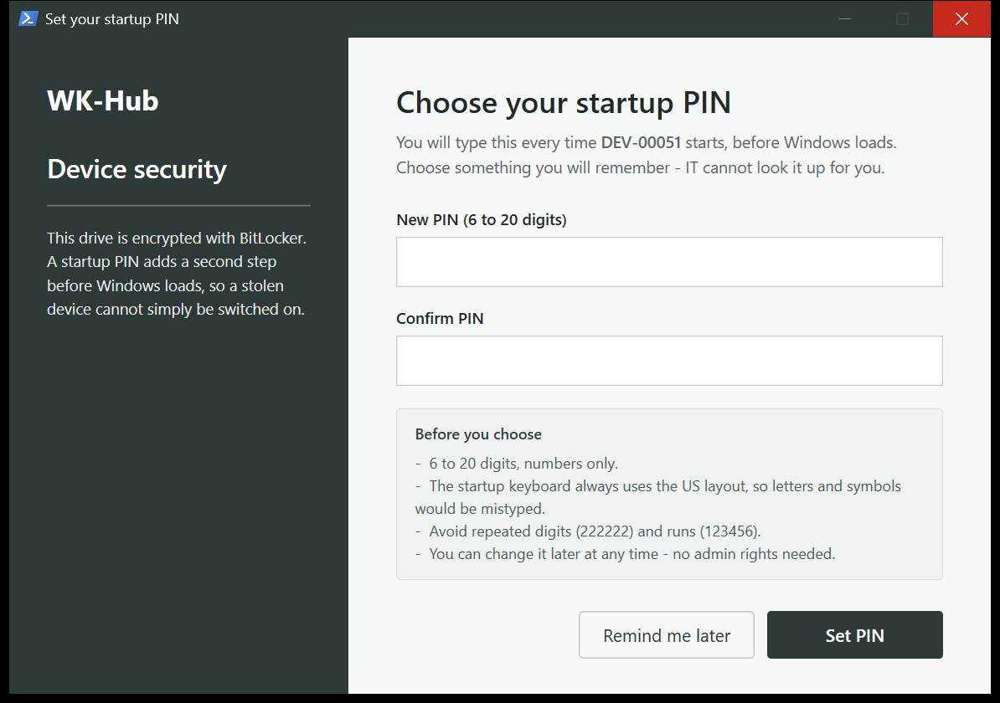
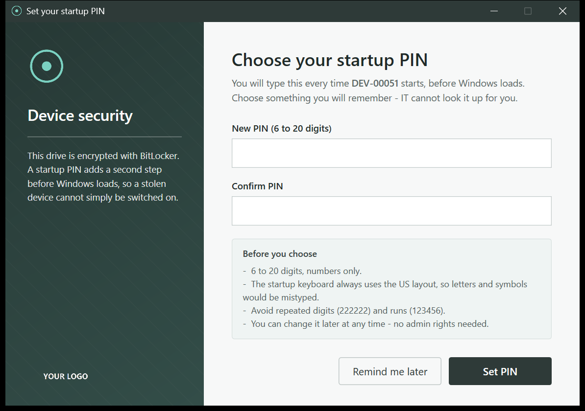

# Branding

Both windows draw a dark **rail** down the left side. That rail is where your
branding goes: a wallpaper image behind it, a logo mark at the top, and a
wordmark at the foot.

Branding is a **drop-in, never a dependency**. Supply artwork and it is staged and
used automatically. Supply none and the windows fall back to a text wordmark on a
solid colour — same layout, same behaviour, and it looks deliberate rather than
broken.

| No artwork (default) | With the three PNGs |
|---|---|
|  |  |

A missing image can never stop the dialog appearing. WPF resolves
`<Image Source="…"/>` while the XAML is being *parsed*, so a path that does not
exist throws out of `XamlReader.Load` and takes the whole window down. The markup
for an image is therefore only emitted when the file is actually on disk — an
element that is never written cannot fail to load.

---

## The three files

Drop them next to the scripts, under **exactly** these names. Any of the three
can be omitted independently.

| File | Where it appears | Size | Format |
|---|---|---|---|
| `brand-logo-square.png` | window icon, and the mark at the top of the rail | **256 × 256** | PNG, transparent background |
| `brand-logo-on-dark.png` | wordmark at the foot of the rail | **~600 × 160** | PNG, transparent, must read on a *dark* backdrop |
| `brand-background.png` | the rail wallpaper | **~800 × 1200 portrait** | PNG |

Working samples at the right dimensions are in
[`docs/branding-sample/`](docs/branding-sample/) — copy them, open them, replace
the contents, keep the sizes.

---

## The wallpaper, specifically

`brand-background.png` is the one people get wrong, because the rail is not a
normal image slot.

**How it is drawn:**

```xml
<Image Source="brand-background.png" Stretch="UniformToFill" HorizontalAlignment="Right"/>
<Border Background="#B316121F"/>
```

Three consequences, and all three matter:

1. **`UniformToFill` crops.** The image is scaled until it covers the rail, then
   the overflow is cut off. The rail is a tall narrow column (230 px wide, full
   window height), so a landscape photo loses everything but a thin middle band.
   **Use a portrait image.** 800 × 1200 is a safe ratio.

2. **`HorizontalAlignment="Right"` decides what survives the crop.** When the
   image is wider than the rail, the *right* edge is kept and the left is cut.
   Put your focal point on the right-hand side of the file.

3. **A ~70 %-opaque dark scrim (`#B316121F`) is painted over the whole thing.**
   This is not optional and not configurable — it is what keeps the white
   headings and body text readable over arbitrary artwork. So:
   - Bright, high-contrast, or busy images come out muddy. Pick something with
     large calm areas.
   - **Never put text or a logo inside the wallpaper.** It will be dimmed by the
     scrim and fight the real wordmark drawn on top of it. That is what
     `brand-logo-on-dark.png` is for.
   - A subtle gradient or a soft abstract texture reads far better than a photo.

If you want a flat colour instead of an image, supply no `brand-background.png`
and set the rail colour (see below).

---

## Colours

| Knob | Default | What it does |
|---|---|---|
| `-BrandColour` on `Get-BrandXaml` | `#FF16121F` | Fills the rail when there is no `brand-background.png`. It is the same value as the window background, so an unbranded rail reads as a design choice |
| Window background (in the XAML) | `#FF16121F` | Also painted onto the **native Windows 11 title bar** through DWM, so the real minimise/close buttons, snapping and accessibility all keep working — a hand-rolled caption bar would lose those. Silently ignored on Windows 10 |
| Rail scrim | `#B316121F` | Fixed. See above |

All are `#AARRGGBB` — alpha first. `FF` is opaque, `B3` is ~70 %.

To change the palette, edit `Get-BrandXaml` in `BitLockerPin.Common.ps1` and the
`Background=` attributes in the two XAML blocks in `Set-BitLockerPin.ps1`. Keep
the rail colour and the window background identical, or the unbranded fallback
looks like a rendering bug.

---

## The wordmark fallback

With no `brand-logo-square.png`, the top of the rail draws your `-Organization`
value as bold white text. That is the *only* place the org name is shown to a
user, and it is why `-Organization` is worth setting even if you never add
artwork — see [QUICKSTART.md](QUICKSTART.md) step 3.

There is deliberately **no** text stand-in at the foot of the rail. The wordmark
above already names you, and a second copy reads as a mistake. So omitting
`brand-logo-on-dark.png` simply leaves that corner empty.

---

## Doing it

```powershell
# 1. Start from the samples.
Copy-Item .\docs\branding-sample\brand-*.png -Destination . -Force

# 2. Replace them with your own artwork, keeping the filenames and sizes.

# 3. Look at the result. No admin rights, no BitLocker changes.
.\Set-BitLockerPin.ps1 -PreviewUI
.\Set-BitLockerPin.ps1 -PreviewNotEncrypted

# 4. Once you are happy, include them in the package (QUICKSTART step 5).
Copy-Item .\brand-*.png -Destination .\Source -Force
```

Then rebuild the `.intunewin`. **Artwork that is not in `Source\` is not in the
package** — the packager reads that folder, not the repo root.

---

## Your artwork is not committed

`.gitignore` contains `brand-*.png` and `*-logo-*.png`, so your real branding
stays yours and is never pushed by accident. The samples under
`docs/branding-sample/` are explicitly re-included, because they are reference
dimensions rather than anyone's brand.

If you would rather track your branding in your own fork, delete those two lines
from `.gitignore`.

---

## Upgrades clean up after themselves

If version 2 of your package drops artwork that version 1 shipped, the installer
removes the stale file from the device. Without that, a device would keep showing
branding the package no longer contains, and no amount of reinstalling would fix
it.

---

## Checklist

- [ ] `brand-background.png` is **portrait**, with the focal point on the right
- [ ] No text or logo baked into the wallpaper
- [ ] `brand-logo-on-dark.png` is legible on a dark background (usually: white)
- [ ] Both logos have **transparent** backgrounds, not white ones
- [ ] `-PreviewUI` and `-PreviewNotEncrypted` both look right
- [ ] The PNGs were copied into `Source\` **before** you built the `.intunewin`
