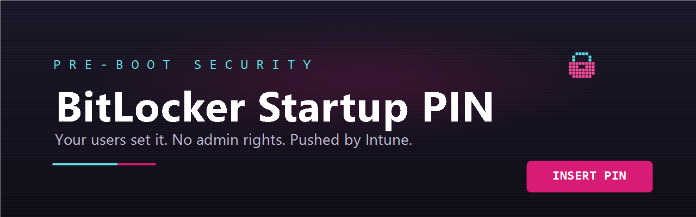
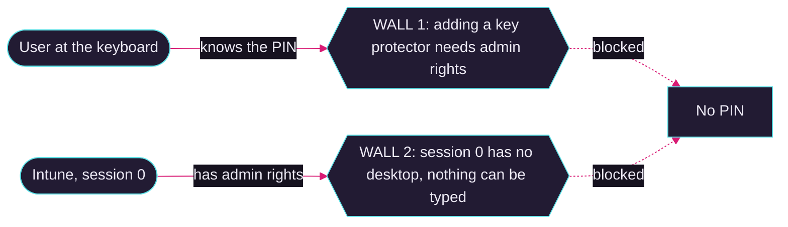
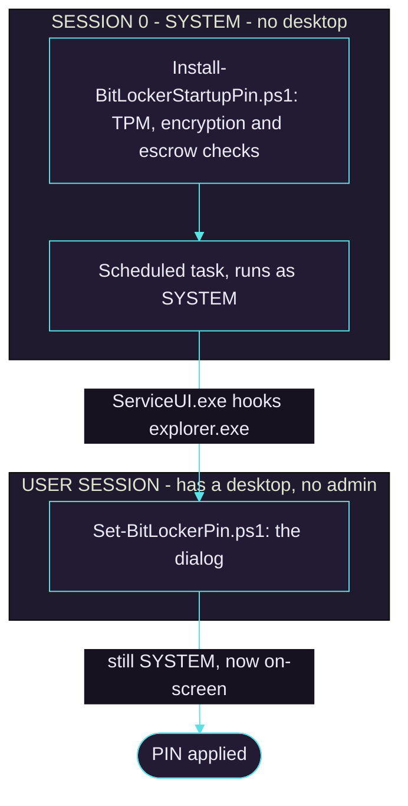
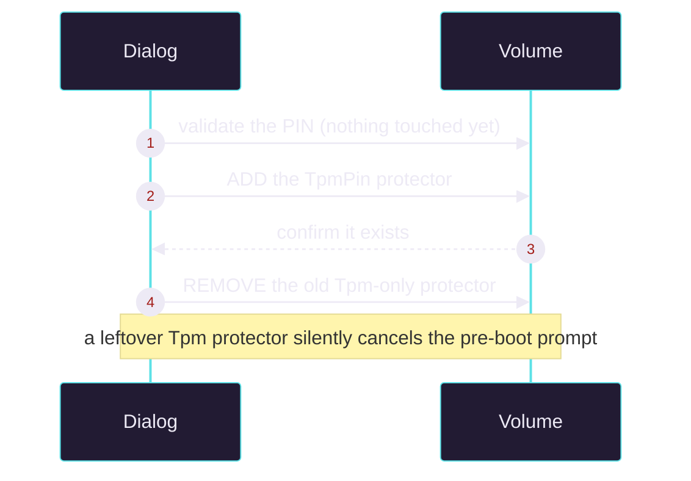

<p align="center">
  
  
  
  
</p>

`P R E - B O O T`

Windows can demand a PIN **before it starts loading**. That is the difference
between *the stolen laptop is encrypted* and *the stolen laptop is encrypted **and
cannot be switched on***.

Intune has no built-in way to collect that PIN from the person at the keyboard.
This is that missing piece.


---

## The problem: two walls, no door



`manage-bde -changepin` called from a Win32 app does not fail loudly. It
**silently does nothing**, because there is no interactive desktop to prompt on.

### The door



`ServiceUI.exe` lends session 0 the user's desktop while the process **stays
SYSTEM**. Admin rights and a keyboard, at the same time.

---

## The rule that keeps devices bootable

Order is everything. Add first, verify, and only then remove.



A TPM-only protector left behind means the device boots **straight into Windows**
and nobody notices the PIN never applied. That is why detection checks for its
absence, not just for the PIN's presence.

---

## Requirements

| | |
|---|---|
| **Devices** | Windows 10 1809+ / Windows 11, x64, TPM 2.0 |
| **Join type** | Entra-joined or hybrid, so the recovery key can escrow |
| **Management** | Microsoft Intune |
| **You supply** | `ServiceUI.exe` (MDT) and `IntuneWinAppUtil.exe`, neither redistributed here |
| **Tests** | 92 passing, touching no BitLocker state |

---

## Start here

| Guide | What it covers |
|---|---|
| **[QUICKSTART.md](QUICKSTART.md)** | Ten steps from a bare repo to a verified pilot device |
| **[INTUNE.md](INTUNE.md)** | Every portal field, and how to stop it fighting your disk-encryption policy |
| **[BRANDING.md](BRANDING.md)** | Your own logo and wallpaper in the dialog |
| **[TROUBLESHOOTING.md](TROUBLESHOOTING.md)** | It is not prompting. Now what? |
| **[docs/REFERENCE.md](docs/REFERENCE.md)** | Architecture, design decisions, every knob |

**Try it right now.** No admin rights, no BitLocker changes, nothing installed:

```powershell
.\Set-BitLockerPin.ps1 -PreviewUI              # the PIN dialog
.\Set-BitLockerPin.ps1 -PreviewNotEncrypted    # the "not encrypted" notice
```

---

## Make it yours

The dialog ships as an arcade cabinet: violet-black body, CRT phosphor cyan,
magenta marquee. Every bit of it is yours to replace.

| Default | With your artwork |
|---|---|
|  |  |

Three PNGs, no code. Branding is a **drop-in, never a dependency**: supply none
and the window falls back to a wordmark with the same layout.
[BRANDING.md](BRANDING.md) has the sizes and the wallpaper gotchas.

---

## What it changes on a device

Everything is namespaced under `-Organization` (default `WK-Hub`).

| | |
|---|---|
| `C:\ProgramData\<Org>\BitLockerPin` | payload and logs; SYSTEM + Administrators only |
| `HKLM\SOFTWARE\<Org>\BitLockerPin` | version and state markers |
| Scheduled task `<Org> BitLocker PIN Enrollment` | runs the dialog in the user's session |
| `HKLM\SOFTWARE\Policies\Microsoft\FVE` | startup-auth values, **backed up first and restored on uninstall** |

It never writes a PIN to a log, a file or a command line, and never removes a
working protector before its replacement is verified.

---

## Exit codes

| Code | Meaning | Intune mapping |
|---|---|---|
| `0` | Enrollment mechanism installed | Success |
| `1618` | Not ready: encrypting, suspended, or escrow unconfirmed | **Retry** |
| `3010` | Success, soft reboot | Soft reboot |
| `1` | Hard blocker: no TPM, missing payload, verification failed | Failed |

`0` even when no PIN is set yet is **deliberate**. This installs the *mechanism*;
the PIN comes later from the dialog, which re-checks every precondition each run.

---

## Read this before you deploy

> **Rehearse recovery first.** A pre-boot PIN turns a forgotten password into a
> recovery-key event. Confirm your service desk can find a key in Entra **today**.

- **Pilot with 5-10 devices.** Not a ring. Not a department.
- **Exclude shared, kiosk and Wake-on-LAN devices.** A pre-boot prompt stops
  unattended boot dead.
- Uninstalling deliberately **leaves the PIN in place**. Removing a deployment
  tool must not quietly weaken a device; `-RemovePinProtector` is the explicit
  rollback.

---

## Licence

MIT, see [LICENSE](LICENSE). `ServiceUI.exe` and `IntuneWinAppUtil.exe` are
Microsoft's, licensed by Microsoft, and are not distributed here.
