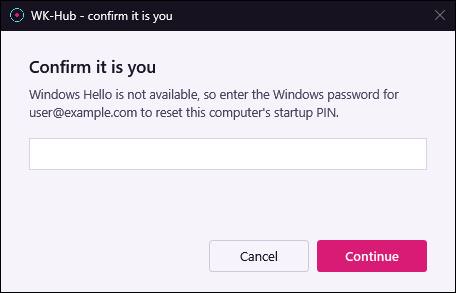

# BitLocker Startup PIN — engineering reference

> Deep reference. If you just want to deploy it, start with **[QUICKSTART.md](../QUICKSTART.md)**.

Prompts the signed-in user to choose a BitLocker pre-boot startup PIN (TPM+PIN) and
applies it, and lets the device's own user replace a forgotten PIN from the Start menu.
Users do **not** need local administrator rights.

| | |
|---|---|
| **Package** | `Output\Install-BitLockerStartupPin.intunewin` |
| **Version** | 3.3.0 |
| **Tests** | 119 passing (`Test-BitLockerPinApp.ps1`) |
| **Target** | Windows 10 1809+ / Windows 11, x64, Entra-joined, TPM 2.0 |
| **Troubleshooting** | [TROUBLESHOOTING.md](../TROUBLESHOOTING.md) |

---

## 1. What the user sees

**A window at logon, and after every screen unlock, until a PIN is set.** It shows
the device name, two PIN boxes, the rules, and inline validation. The title bar is a real
Windows caption painted in the brand colour, so the window can be moved, minimised and
closed normally.

- **Set PIN** — validates, applies the protector, confirms, and disables its own task.
- **Remind me later** (or the **X**) — asks again **at the next screen unlock**. Event-based
  on purpose: it catches people when they return to the machine instead of interrupting
  them on a timer.

**If the device is not encrypted**, they get a different, information-only notice: it says
so plainly, says it is not something they can fix, and gives a copyable reference line
(device name + volume state) for the service desk. Throttled to once per 24 hours.
Encryption still *in progress*, or a suspended-but-encrypted volume, stay silent —
warning about transient states teaches people to dismiss IT windows.

**If they forget the PIN later**, Start → **Reset BitLocker PIN** opens the *manage
window*: "Your startup PIN is set", the device name (and when the PIN was set, if this
app set it), and two buttons. **Close** is the default, so pressing Enter never starts a reset; **Reset my PIN**
starts one. (They still need the recovery key once to get past the pre-boot screen and
into Windows. See §9.)

| Manage window, no branding | Manage window, sample branding |
|---|---|
|  |  |

- **Windows Hello prompt:** *"Verify your identity to reset the BitLocker startup PIN on
  DEV-00051"*, shown in the user's own session in front of a small, unbranded *"Waiting for
  Windows Hello..."* window that the prompt belongs to.
- **Password prompt:** a **Confirm it is you** window asking for the Windows password,
  shown only when Hello cannot run for this user on this device.

  

- **Then the ordinary PIN dialog**, in reset mode. The new PIN applies from the next boot.
- **Refusal notices** use the same layout as the "not encrypted" notice, each with a
  copyable reference for the service desk: *Only the assigned user can reset this PIN*,
  *Too many PIN resets today*, *Identity was not verified* (Hello declined) and *That
  password was not accepted*.

In all there are four windows (the PIN dialog, the notice, the manage window and the
password prompt), plus the small Hello wait window.

Preview them, no admin and no BitLocker changes:

```powershell
.\Set-BitLockerPin.ps1 -PreviewUI              # the PIN dialog
.\Set-BitLockerPin.ps1 -PreviewNotEncrypted    # the "not encrypted" notice
.\Set-BitLockerPin.ps1 -PreviewManage          # the manage window; "Reset my PIN" opens the password prompt
```

`-PreviewManage` verifies nothing and changes nothing. The Hello prompt has no preview,
because it can only come from a real user session.

---

## 2. Architecture

### The problem it works around

Adding a BitLocker key protector requires administrator rights, and standard users have none.
Intune runs in **session 0**, which has no interactive desktop — which is why
`manage-bde -changepin` silently fails when a Win32 app calls it directly. So the PIN
cannot be collected by the installer, and it cannot be applied by the user.

The app therefore splits into an unattended part and an interactive part, and bridges the
session boundary with `ServiceUI.exe`.

```
┌─ Intune Management Extension (SYSTEM, session 0, 32-bit) ────────────────┐
│                                                                         │
│  Install-BitLockerStartupPin.ps1                                        │
│    ├─ relaunch via %windir%\SysNative ─────────────► 64-bit PowerShell  │
│    ├─ TPM readiness            (Get-Tpm)                                │
│    ├─ FVE policy + backup      (HKLM\...\Policies\Microsoft\FVE)        │
│    ├─ encryption / recovery password / Entra escrow (event 845)         │
│    ├─ stage payload            ─► C:\ProgramData\<Org>\BitLockerPin     │
│    ├─ harden folder            (icacls, SID literals, SYSTEM+Admins)    │
│    └─ register scheduled task  (Task Scheduler XML 1.2)                 │
│                                                                         │
└─────────────────────────────┬───────────────────────────────────────────┘
                              │ triggers: logon +2 min, session unlock +20 s
                              ▼
┌─ Task "WK-Hub BitLocker PIN Enrollment" (SYSTEM, HighestAvailable) ─────┐
│                                                                         │
│  ServiceUI.exe -process:explorer.exe  powershell.exe -File …            │
│    └─ hooks explorer.exe to borrow the user's desktop,                  │
│       while the process itself stays SYSTEM                             │
│                                                                         │
└─────────────────────────────┬───────────────────────────────────────────┘
                              ▼
┌─ Set-BitLockerPin.ps1  (SYSTEM, rendering in the user's session) ───────┐
│                                                                         │
│  console-session guard (fail closed)                                    │
│  encryption scan ─► not encrypted? ─► "contact IT" notice, exit         │
│  recovery password + escrow gate   ─► refuse if unproven                │
│  WPF dialog (XAML) ─► SecureString validation (no managed string)       │
│  ADD TpmAndPin ─► verify ─► REMOVE Tpm ─► verify ─► disable own task    │
│                                                                         │
└─────────────────────────────────────────────────────────────────────────┘

Reporting, deployed separately as an Intune Remediation:
  Detect-BitLockerPinCompliance.ps1    ─► is a PIN really set and enforced?
  Remediate-BitLockerPinCompliance.ps1 ─► fix what a script can, prompt again

Self-service reset, started on demand (the task has no triggers):
  Start ─► "Reset BitLocker PIN" ─► schtasks /run ─► Task "WK-Hub BitLocker PIN Reset"
    ─► ServiceUI.exe ─► Set-BitLockerPin.ps1 -Manage (SYSTEM, same guard + pre-flight)
    ─► manage window ─► identity ─► throttle ─► Hello / password ─► same reset path as -Force
```

### Why the protector order is add → verify → remove

A volume can hold **both** a `Tpm` and a `TpmPin` protector, and Windows documents that the
plain TPM protector *"negates the effects of other TPM-based key protectors"*. So a device
holding both boots with **no PIN prompt at all**, while any check that merely looks for
`TpmPin` reports success.

Adding first means the device stays bootable throughout, and a failed add has removed
nothing. Removing first — the obvious order, and what most published scripts do — opens a
window in which only the 48-digit recovery key can unlock the volume.

### State it owns on the device

Everything is namespaced under the `-Organization` value, which defaults to `WK-Hub`.
Change it once in each script and every path below moves with it. The self-test asserts
that all seven files agree, including the `-Organization` default of `Write-PinAudit` in
`BitLockerPin.Common.ps1`, which names the event source. The one name that does not move
is the Start-menu shortcut: *Reset BitLocker PIN* is generic on purpose.

| Location | Contents |
|---|---|
| `C:\ProgramData\WK-Hub\BitLockerPin` | payload, `install.log`, `prompt.log` (including `AUDIT` lines for every reset decision); ACL: SYSTEM + Administrators only |
| `HKLM\SOFTWARE\WK-Hub\BitLockerPin` | `Version`, `InstalledOn`, `MinimumPin`, `UnlockTrigger`, `RecoveryEscrowed`, `PinSetOn`, `NotEncryptedWarnedOn`, `FvePolicyBackup`; after a self-service reset also `ResetHistory` (`REG_MULTI_SZ` of `yyyy-MM-ddTHH:mm:ss` completion times, trimmed to 30 days), `LastResetOn` (`REG_SZ`) and `ResetCount` (`DWORD`, total completed self-service resets). Every successful set or reset updates `PinSetOn` |
| `HKLM\SOFTWARE\Policies\Microsoft\FVE` | 8 values, previous state saved for uninstall |
| Task Scheduler | `WK-Hub BitLocker PIN Enrollment`: logon and unlock triggers; users can see it but not start it, `(A;;GR;;;AU)` |
| Task Scheduler | `WK-Hub BitLocker PIN Reset`: **no triggers**, SYSTEM, runs `Set-BitLockerPin.ps1 -Manage` through `ServiceUI.exe`, one instance at a time, 30-minute limit. Authenticated users may start it: `D:P(A;;GA;;;SY)(A;;GA;;;BA)(A;;GRGX;;;AU)` |
| Start menu | `%ProgramData%\Microsoft\Windows\Start Menu\Programs\Reset BitLocker PIN.lnk` → `%SystemRoot%\System32\schtasks.exe /run /tn "WK-Hub BitLocker PIN Reset"` (BitLocker icon from `fvecpl.dll`, runs minimised) |
| Application event log | source `WK-Hub-BitLockerPin`, reset audit events 3200–3204 (§9.1). Uninstall **leaves** it registered so historic reset events stay readable |

The reset task, the shortcut and the event source are all optional to the install: if any
of them cannot be registered, `install.log` gets a `WARN` and the install still succeeds.
The user then falls back to the service desk for a reset. The app detection rule
deliberately does not check them, so a soft failure there cannot become a reinstall loop.

---

## 3. Languages, frameworks and tooling

Everything is Windows-native and needs no runtime beyond what ships with the OS —
deliberately, so there is nothing to install, patch, or get blocked by app control.

| Technology | Where | Why this and not something else |
|---|---|---|
| **Windows PowerShell 5.1** | all eight scripts | What ships in-box and what the Intune agent and Task Scheduler invoke. PowerShell 7 is not on a stock image, and the `BitLocker` module is a CDXML module over WMI that 5.1 loads natively |
| **XAML / WPF** (`PresentationFramework`) | the four windows: PIN dialog, notice, manage window, password prompt | In-box GUI with real layout and DPI scaling. WinForms would not scale cleanly at 150 %; a web UI would need a runtime |
| **Task Scheduler XML** (schema 1.2) | task registration | The session-unlock trigger has no cmdlet, and mixing a `New-CimInstance` trigger with a `New-ScheduledTaskTrigger` one fails PSTypeName binding. XML sidesteps both |
| **C# via `Add-Type`** (P/Invoke) | `dwmapi!DwmSetWindowAttribute` for the brand-coloured caption; `kernel32!WTSGetActiveConsoleSessionId` for the session guard; for the self-service reset, `advapi32!LogonUser` (password check) and `WTSQueryUserToken` + `CreateProcessAsUser` + a named pipe (launching the Hello verifier and hearing back from it) | No managed API exposes any of them. The first two have compile-free fallbacks, because `Add-Type` spawns `csc.exe` and EDR/WDAC can block that. The reset's calls have none, so a blocked compiler makes them **fail closed**: no verification, no reset |
| **WinRT** `UserConsentVerifier` | the Windows Hello prompt | The in-box way to ask for Hello. It is called through `IUserConsentVerifierInterop::RequestVerificationForWindowAsync`, because the plain `RequestVerificationAsync` never completes in a desktop app (§9.1) |
| **WMI / CIM** | `Win32_Process` (find an open dialog), `MSFT_ScheduledTask`, `Win32_EncryptableVolume` via the `BitLocker` module | Architecture-neutral and in-box |
| **Win32 console tools** | `icacls.exe` (folder hardening), `manage-bde.exe` (user-facing PIN change) | `icacls` is called with **SID literals** only — English account names fail with exit 1332 on non-English Windows |
| **`ServiceUI.exe`** | session-0 → user-desktop bridge | Microsoft binary, x64, Microsoft-signed, **SHA256-pinned** by the installer. Not shipped with this package — see §5 |
| **Markdown** | this file, `TROUBLESHOOTING.md` | — |
| **IntuneWinAppUtil.exe** | packaging | Microsoft Win32 Content Prep Tool. Not shipped with this package — see §5 |

**Not used, on purpose:** Electron or any bundled runtime (adds ~150 MB and solves nothing
— a non-admin process still cannot add a key protector); compiled binaries (nothing to
sign or version); PowerShell 7 (not on a stock image); external modules (nothing to trust
or update).

---

## 4. Components

| File | Runs as | Job |
|---|---|---|
| `Install-BitLockerStartupPin.ps1` | SYSTEM | FVE policy, encryption/escrow checks, staging, task registration |
| `Set-BitLockerPin.ps1` | SYSTEM, on the user's desktop | the dialog, the notice, and the self-service manage window and password prompt; validates the PIN and swaps the protector |
| `BitLockerPin.Common.ps1` | dot-sourced | shared helpers: escrow check, policy relax, path hardening, console session, branding, and the self-service reset's gates and audit trail |
| `ServiceUI.exe` | — | lends session 0 the user's desktop. **You supply this** — see §5 |
| `brand-*.png` | — | optional brand images for the windows' brand rail and icon — see §5 |
| `Detect-BitLockerStartupPin.ps1` | SYSTEM | Win32 **app** detection rule (uploaded separately) |
| `Uninstall-BitLockerStartupPin.ps1` | SYSTEM | removes the mechanism, restores the FVE policy |
| `Detect-BitLockerPinCompliance.ps1` | SYSTEM, 64-bit | **Remediations** detection — is a PIN really set and enforced? |
| `Remediate-BitLockerPinCompliance.ps1` | SYSTEM, 64-bit | **Remediations** fix — clears a cancelling protector, re-prompts |
| `Test-BitLockerPinApp.ps1` | any | 119-case self-test, touches no BitLocker state |

`Source\` is the packaging staging folder — the content-prep tool reads it, not the repo
root. Copy the four scripts into it (plus `ServiceUI.exe` and any brand PNGs) before
building; §5 has the exact command.

### Self-service entry points (`Set-BitLockerPin.ps1`)

| Switch / function | Used by | What it does |
|---|---|---|
| `-Manage` | the `WK-Hub BitLocker PIN Reset` task, as SYSTEM | Device has a PIN: the manage window, then the three gates, then the reset. Device has no PIN yet: the ordinary first-PIN dialog, exactly as the enrolment task shows it. Runs the same console-session guard and pre-flight as enrolment first |
| `-PreviewManage` | anyone, no admin | Renders the manage window and, if you press *Reset my PIN*, the password prompt. Verifies nothing, changes nothing |
| `-Force` | the service desk, as SYSTEM | Unchanged: the reset without the gates. The reset task carries `-Manage` and never `-Force` |
| `Show-ManageWindow` | `-Manage`, `-PreviewManage` | Returns `$true` only if the user pressed *Reset my PIN*. Any failure returns `$false`, because a window that could not be drawn must not be read as consent. Close is the default button. Images go through `Get-BrandXaml`, so a device with no artwork is still offered the reset |
| `Show-PasswordPrompt` | the Hello fallback | Returns a `SecureString` copied from the `PasswordBox`, or `$null` on Cancel or failure. The UPN is set from code, not spliced into the XAML |
| `Enable-EnrollmentTask` | a failed reset | The inverse of `Disable-EnrollmentTask`. Re-arms the enrolment task when a failed reset has left the device with no PIN |

### Self-service helpers (`BitLockerPin.Common.ps1`)

| Helper | Returns | Notes |
|---|---|---|
| `Get-EnrolledUpn` | the MDM enrolment UPN, or `$null` | Value `UPN` under `HKLM\SOFTWARE\Microsoft\Enrollments\<GUID>`, taken only from a key that also has `ProviderID` (the per-resource subkeys carry neither). The closest local stand-in for Intune's primary user, which lives in Graph and needs a token |
| `Get-ConsoleUser` | `SessionId`, `Sid`, `Upn`, or `$null` | Built on `Get-ConsoleSessionId`, not on whichever `explorer.exe` ServiceUI hooked. The SID is the owner of the console session's `explorer.exe`; the UPN is `UserName` under `HKLM\SOFTWARE\Microsoft\IdentityStore\Cache\<SID>\IdentityCache\<SID>`. A local account has no UPN, which is the right answer |
| `Test-ConsoleUserIsPrimary` | `$true` / `$false` | `$true` only for a trimmed, case-insensitive match. A missing enrolment UPN, an unknown console user or a missing UPN all return `$false` |
| `Test-WindowsPassword` | `$true` / `$false` | `LogonUser` with the interactive logon type, which validates against cached credentials, so it works offline. The password goes `SecureString` → unmanaged buffer → API → zero-freed. Returns `$false` if `Add-Type` is blocked |
| `Write-PinAudit` | nothing | Writes `AUDIT <Action> - <detail>` to `prompt.log` and, if the source exists, event 3200–3204 to the Application log under `<Org>-BitLockerPin`. Never throws: auditing must not fail an operation that worked |
| `Test-PinResetAllowed` | `$true` / `$false` | `$false` once `-MaxPerDay` (default 3) completed resets fall within the last 24 hours. No history means no resets yet (`$true`); an unreadable history means `$false` |
| `Add-PinResetRecord` | nothing | Appends to `ResetHistory` (trimmed to 30 days), sets `LastResetOn`, increments `ResetCount`. Bookkeeping only; never fails the caller |
| `Invoke-HelloVerification` | `Verified`, `Declined`, `Unavailable` or `Error` | Launches the verifier and waits up to 120 s (the verifier gets 15 s less, so a slow one reports its own timeout). Declined also covers a prompt that timed out or was never answered. Unavailable covers Hello not set up, disabled by policy, or a verifier that could not start. Error covers a result that could not be authenticated |
| `$script:HelloVerifierScript` | — | The verifier's PowerShell source, run in the console user's session. Exit/report codes: 0 verified, 1 declined, 2 Hello unusable, 3 error, 4 shown but never answered. Each result is sent both over the pipe and as the exit code |
| `$script:UserSessionCSharp` | — | The C# launcher, `PinAuth.UserSession.Run`. Creates the result pipe, launches the verifier (as the console user when called as SYSTEM), checks the client process ID and compares the report with the exit code. Returns the verified result, or -1 (could not launch), -2 (timed out) or -3 (no authenticated result). Kept as a string so it is only compiled on the path that needs it |

---

## 5. What you must supply, and how to build

### 5.1 Binaries you must supply yourself

Two Microsoft tools are needed and are **deliberately not redistributed here** — their
licences are Microsoft's to grant, not this package's. Download them once, keep them out
of source control, and the rest works unchanged.

| File | Where it comes from | Where to put it |
|---|---|---|
| `ServiceUI.exe` (x64) | Microsoft Deployment Toolkit (MDT). Install the MDT MSI, then take the x64 build from `C:\Program Files\Microsoft Deployment Toolkit\Templates\Distribution\Tools\x64\ServiceUI.exe`. MDT has been retired, so archive a copy of the MSI once you have it | next to these scripts, and into `Source\` before packaging |
| `IntuneWinAppUtil.exe` | Microsoft Win32 Content Prep Tool — the official repository is `microsoft/Microsoft-Win32-Content-Prep-Tool` on GitHub; download the released `IntuneWinAppUtil.exe` | anywhere on `PATH`, or the repo root |

The installer refuses to run without `ServiceUI.exe`, checks that it carries a valid
Microsoft Authenticode signature, and compares its SHA256 against a pinned value — this
binary becomes the entry point of a SYSTEM scheduled task, so it is not taken on trust.
The pinned default is the MDT 8456 x64 build. If your copy comes from a different MDT
release the install fails with the hash it actually saw; satisfy yourself the binary is
genuine and then pass that hash:

```powershell
.\Install-BitLockerStartupPin.ps1 -ServiceUiSha256 '<SHA256 OF YOUR SERVICEUI.EXE>'
```

Loosening or removing the check is the wrong fix.

### 5.2 Branding (optional)

The PIN dialog, the notice and the manage window draw a brand rail; the password prompt
has no rail and uses only the window icon, and all four get the brand-coloured title bar.
Branding is a **drop-in, never a dependency**: supply artwork and it is staged and
used automatically; supply none and the windows fall back to a text wordmark on a solid
colour, with the same layout and the same behaviour. A missing image can never stop the
dialog appearing, or stop the manage window offering a reset. The markup for an image is
only emitted when the file is actually there, because WPF resolves `<Image Source="…"/>`
while the XAML is being parsed.

Drop your own PNGs next to the scripts (and into `Source\` before packaging) under exactly
these names:

| File | Used for | Suggested size |
|---|---|---|
| `brand-logo-square.png` | window icon and the mark at the top of the rail | 256 × 256, transparent background |
| `brand-logo-on-dark.png` | wordmark at the foot of the rail; must read on a dark backdrop | ~600 × 160, transparent background |
| `brand-background.png` | backdrop image behind the rail, overlaid with a dark scrim | ~800 × 1200, portrait |

Any of the three can be omitted independently. The wordmark text and the fallback colour
come from `Get-BrandXaml` in `BitLockerPin.Common.ps1`: the text is the `-Organization`
value, and `-BrandColour` (default `#FF16121F`) is the same value as the window
background, so an unbranded window looks deliberate rather than broken. An upgrade that
drops artwork the previous version had also removes the stale file from the device.

### 5.3 Build

```powershell
Copy-Item .\Install-BitLockerStartupPin.ps1,.\Uninstall-BitLockerStartupPin.ps1,`
          .\Set-BitLockerPin.ps1,.\BitLockerPin.Common.ps1,.\ServiceUI.exe `
          -Destination .\Source -Force
# plus any brand-*.png you supplied
Copy-Item .\brand-*.png -Destination .\Source -Force -ErrorAction SilentlyContinue

.\IntuneWinAppUtil.exe -c .\Source -s Install-BitLockerStartupPin.ps1 -o .\Output -q
```

The packager reads `Source\`, not the repo root, so an edited script that was not copied
across ships the old version.

---

## 6. Intune: the Win32 app

Create **Apps → Windows app (Win32)** and upload the `.intunewin`. To update, replace the
package file in **Properties** — do not create a second app.

**Program**

| Field | Value |
|---|---|
| Installer type | Command line |
| Install command | `powershell.exe -NoProfile -ExecutionPolicy Bypass -File .\Install-BitLockerStartupPin.ps1 -MinimumPin 6` |
| Uninstaller type | Command line |
| Uninstall command | `powershell.exe -NoProfile -ExecutionPolicy Bypass -File .\Uninstall-BitLockerStartupPin.ps1` |
| Installation time required | 15 mins |
| Install behavior | **System** |
| Device restart behavior | No specific action |

Bitness is handled by the scripts: each relaunches itself through `%windir%\SysNative` when
it sees `PROCESSOR_ARCHITEW6432`, so plain `powershell.exe` lands in 64-bit either way.

**Requirements:** OS architecture x64, minimum Windows 10 1809.

**Detection rules:** *Use a custom detection script* → upload
`Detect-BitLockerStartupPin.ps1`. Run as 32-bit: **No**. Enforce signature check: **No**.
Leave the manual Type/Path/Code rules empty.

> Re-upload the detection script whenever you replace the package. Both carry the same
> version, and a mismatch causes either a permanent reinstall loop or a stuck stale build.

**Return codes** — add 1618 if not already present:

| Code | Meaning | Type |
|---|---|---|
| 0 | Enrollment mechanism installed | Success |
| 1707 | — | Success |
| 1618 | TPM present but not yet provisioned | **Retry** |
| 3010 | Success, soft reboot | Soft reboot |
| 1641 | — | Hard reboot |
| 1 | Hard failure — read `install.log` | Failed |

**The installer returns 0 even when no PIN is set yet, deliberately.** It installs the
*mechanism*; the PIN comes later from the dialog, which re-checks every precondition each
run. An earlier version returned 1618 while a volume was still encrypting, which meant a
device in Autopilot ESP never received the payload — so detection never succeeded and
nothing ever prompted.

**Assignment:** device groups, Required. Start with 5–10 devices. Exclude shared/kiosk
machines and anything patched by Wake-on-LAN.

---

## 7. Intune: the Remediation (PIN coverage)

**The Win32 app can only report Installed or Failed — that is the mechanism, not the PIN.**
A device can show *Installed* for weeks while the user keeps clicking *Remind me later*.
This pair answers the real question.

**Devices → Scripts and remediations → Create**

| Field | Value |
|---|---|
| Detection script | `Detect-BitLockerPinCompliance.ps1` |
| Remediation script | `Remediate-BitLockerPinCompliance.ps1` |
| Run this script using the logged-on credentials | **No** |
| Enforce script signature check | No |
| Run script in 64-bit PowerShell | **Yes** |
| Schedule | Daily |

**Detection reports compliant only when all four hold:** a `TpmPin` protector exists, **no**
plain `Tpm` protector remains, `ProtectionStatus` is On, **and** a recovery password
exists. It never reports compliant when it cannot tell — an unreadable volume returns
`UNKNOWN … exit 1`, so a broken query can never turn the fleet green.

Its single output line lands in the portal's *Detection output* column and names the reason
plus the full context, for example:

```
NONCOMPLIANT: no startup PIN protector - user has not set a PIN | device=DEV-00051
volume=FullyEncrypted protection=On protectors=Tpm,RecoveryPassword recovery=yes
escrowed=yes pinSetOn=never pinChangedByUser=no app=3.3.0 task=Ready
```

so you can sort the report by *who has not set a PIN* versus *who cannot*.

**Remediation** does what a script legitimately can:

1. Removes a stray `Tpm` protector that is cancelling an existing PIN — a real fix, needing
   no user, and refused unless a recovery password exists.
2. Re-enables and restarts the enrollment task so the user is prompted again.
3. **Reports rather than pretends** for anything needing a human — unencrypted volume,
   missing recovery password, suspended protection — and exits non-zero so it surfaces.

`pinChangedByUser` comes from events 777/789, the only reliable signal: `ChangePIN` reuses
the protector GUID, so comparing stored and current IDs detects nothing. Use it to see who
is still on a PIN that IT handed them.

---

## 8. Design decisions worth knowing

**`UseTPM` is never set to 0.** FVE values gate protector *creation*, so `UseTPM=0` makes
every TPM-only fallback impossible — including the rollback after a failed add. Enforce
"PIN required" with a compliance policy instead.

**Protector work runs with startup-auth policy temporarily relaxed.** BitLocker validates
the volume's whole protector set on *any* change, so a device already non-compliant with
its own policy cannot be repaired. Seen in the field: a profile setting `UseTPM=0` +
`UseTPMPIN=1` on a volume still holding only a `Tpm` protector made even *adding the
recovery password* fail with `0x80310061` — a deadlock, since the PIN add is what would
make it compliant. `Invoke-WithStartupAuthRelaxed` relaxes both values for the duration of
each call and always restores them; the end state satisfies the strict policy anyway.

**Escrow is a prerequisite, enforced at the point of change.** The dialog will not touch a
protector unless a recovery password exists *and* Entra escrow is either confirmed by event
845 or freshly succeeded in that run. The check is three-state — escrowed / no evidence /
cannot tell — because `Get-WinEvent` **throws** when a filter matches nothing, so a naive
`try/catch` collapses "never escrowed" into "log unreadable".

**Digits only.** `UseEnhancedPin = 0`: the pre-boot keyboard is always US layout, so an
alphanumeric PIN gets mistyped at boot on a German keyboard.

**The PIN never becomes a managed string.** A `System.String` cannot be zeroed, so it would
linger in the freed heap of a long-lived SYSTEM process. Validation reads the
`SecureString` BSTRs directly and zeroes them, and never uses `-match` (which would leave
the PIN in `$Matches`).

**`icacls` uses SID literals, never account names,** which fail with exit 1332 on
non-English Windows and leave the ACL untouched.

**The payload path must contain no space.** ServiceUI strips double quotes from the command
line it forwards, so a path under `C:\Program Files\...` arrives as `-File C:\Program` and
the dialog never starts. The installer throws if the path ever contains whitespace.

**The dialog only draws on the console session,** and fails closed if it cannot determine
which — otherwise, with fast user switching or RDP, the wrong user could choose the PIN
everyone types at boot.

**Policy ownership.** The app writes only what a PIN needs, and never `UseTPMKey` /
`UseTPMKeyPIN` — it creates no USB startup-key protectors, and writing those merely fights
the Intune BitLocker CSP, producing event 851 *"BitLocker startup options are in
conflict"*. If `UseTPMPIN` keeps reverting to `0`, set *Configure TPM startup PIN: Allow
startup PIN with TPM* in the profile, or exclude these devices from it.

**The self-service reset has its own task, and only that task is user-startable.** A user
who has forgotten their PIN is not an administrator and cannot elevate, so the only way to
let them fix it is to let them start a SYSTEM task. The enrolment task keeps
`(A;;GR;;;AU)`: users can see it but not start it. The reset task gets `(A;;GRGX;;;AU)`,
and `GX` is the single bit that makes self-service possible. As two separate tasks,
widening the reset task's ACL can never widen the enrolment task's. The reset task has no
triggers, so it never prompts anybody on its own, and it carries `-Manage`, never `-Force`.
Starting the task is not the privilege; passing the gates is.

**The gates run identity → throttle → re-authentication.** Identity comes first, because
asking a stranger for a credential tells them the credential was the only thing in their
way. The throttle comes before re-authentication, because a Hello prompt that cannot lead
anywhere only teaches people to approve prompts without reading them. The throttle counts
completed resets only, so a refused attempt never costs the real user a slot. A test
asserts the order.

**Windows Hello before the password.** On an Entra-joined, Hello-first device there is no
cached password verifier, so `LogonUser` rejects even the correct password with 1326. Hello
is the credential those users actually hold. The password is only a fallback for when Hello
cannot give a result at all. A Hello prompt that is *declined* stops the reset, because
falling back would turn a failed check into a second guess at a different credential.

**The Hello result travels over a PID-checked named pipe, not the exit code.** Hello
cannot run as SYSTEM, so the verifier runs as the user, and anything else running as that
user could end it with exit code 0. SYSTEM therefore creates the result pipe before it
launches the verifier: one instance only, remote clients rejected. A report counts only if
the connection comes from the verifier's own process ID and the exit code agrees with it.
The launcher holds the verifier's process handle, so the ID cannot be recycled. Anything
else is `Error`, never `Verified`: exit 0 with no report, a malformed report, a
contradicting exit code, or a report from another process. `Error` leads to the password
prompt, not to a reset.

**The throttle fails closed.** An unreadable reset history is a support case, not a reason
to allow unlimited resets. Whoever is asking has already reached Windows, so sending them
to the service desk strands nobody. Only a key or value that does not exist yet means "no
resets yet"; a read that fails for any other reason refuses, a value of the wrong type
refuses, and an entry that is not a date counts as a recent reset instead of being skipped.

**A failed reset that loses the PIN re-arms enrolment and says so.** The reset has to
remove the old PIN protector before adding the new one (§9), so a failed add can leave the
device rolled back to TPM-only: it boots, but with **no PIN**. A plain "could not set your
PIN" would leave the user believing the old PIN still stands. So the dialog says the
computer now starts without a PIN, the enrolment task is re-enabled so the ordinary prompt
returns at the next logon or unlock even if they walk away, and event 3204 records that the
device was left without a PIN.

---

## 9. Changing or resetting a PIN

Nobody can **read** an existing PIN: not the user, the service desk or this app. A PIN can
only be changed by someone who knows it, or replaced.

- **User who knows the current PIN, no admin:** `manage-bde -changepin C:` or Control
  Panel → BitLocker → *Change PIN*. Requires the current PIN. This is the path that
  `DisallowStandardUserPINReset = 0` governs.
- **User who has forgotten it, self-service, no admin:** Start menu → **Reset BitLocker
  PIN**, see §9.1. The shortcut starts a SYSTEM task, because replacing a protector needs
  rights the user does not have. It does not depend on `DisallowStandardUserPINReset`.
- **Service desk forcing a new PIN:** run `Set-BitLockerPin.ps1 -Force` as SYSTEM. This
  still exists, skips the self-service gates by design, and is reachable only by
  administrators. It shares its replacement path with the self-service reset. That is the
  one path that must remove the PIN protector before adding its replacement (only one
  `TpmPin` may exist, and the old PIN is unknown), so it verifies a recovery password first
  and rolls back to a TPM-only protector if the replacement fails.
- **Getting into the device at all:** a user who has forgotten the PIN still needs the
  48-digit recovery key **once**, to get past the pre-boot screen and into Windows. The
  reset only exists inside Windows. Issue the key from Entra (*Devices → device → BitLocker
  keys*), through the service desk, or let the user retrieve it from the Company Portal.

**Unattended mode** (PIN derived from the device name) is implemented and tested but **off
by default**: `-AssignDerivedPin -PinPrefix "111" -DeviceNumberLength 4` turns a device named
`DEV-0051` into `1110051`. Such a PIN is guessable by anyone who knows the naming scheme, so it only
makes sense as an enrolment PIN users are told to change.

### 9.1 Self-service reset

Windows' own *Change PIN* needs the current PIN, so it is no help to someone who has
forgotten it. Replacing the protector is the only route, and that needs rights a standard
user does not have. So the Start-menu shortcut starts a SYSTEM task that any authenticated
user may start, and three gates inside `Set-BitLockerPin.ps1 -Manage` decide whether it
goes any further. **Each gate fails closed.**

**The flow**

1. The user gets past pre-boot with the recovery key (§9) and signs in.
2. Start → **Reset BitLocker PIN** runs `schtasks /run` on `WK-Hub BitLocker PIN Reset`,
   which runs `Set-BitLockerPin.ps1 -Manage` as SYSTEM on the user's desktop through
   `ServiceUI.exe`. It applies the same console-session guard and pre-flight as enrolment:
   the volume must be encrypted, protection on, and a recovery password present and escrowed
   to Entra. Otherwise it defers or exits exactly as enrolment would.
3. **No PIN on the device yet:** it shows the ordinary first-PIN dialog, the same one the
   enrolment task shows at logon. There are no gates here, because this is the existing
   enrolment model.
4. **A PIN exists:** it shows the manage window. *Close* ends the run (logged, no event).
5. *Reset my PIN* runs the three gates below, in order.
6. All three pass: event 3200, then the PIN dialog in reset mode. This is the same code path
   as the service desk's `-Force`: remove the old `TpmPin`, add the new `TpmAndPin`, remove
   any TPM-only protector, verify. The new PIN is validated before any protector is touched.
7. Success: `PinSetOn`, `ResetHistory`, `LastResetOn` and `ResetCount` are updated, event
   3203 is written, and the enrolment task stays disabled. The new PIN applies from the
   next boot.

**Gates and outcomes**

| Step | Check | When it fails | Event |
|---|---|---|---|
| 1. Identity | The console user's cached Entra UPN (`Get-ConsoleUser`) equals the MDM enrolment UPN (`Get-EnrolledUpn`), trimmed and case-insensitive | Notice *Only the assigned user can reset this PIN*, showing the signed-in and assigned accounts | 3201 |
| 2. Throttle | Fewer than 3 **completed** self-service resets on this device in the last 24 hours | Notice *Too many PIN resets today* | 3202 |
| 3. Windows Hello | The Hello prompt returns *Verified* | Declined, cancelled, timed out or never answered: notice *Identity was not verified*, and the reset **stops** with no password fallback | 3201 |
| 3. Password (fallback) | Only when Hello is *Unavailable* or *Error*: the **Confirm it is you** window, checked with `LogonUser` against cached credentials | Wrong password: notice *That password was not accepted*. Cancel: exits quietly, no event | 3201 |
| All passed | — | — | 3200, then 3203 or 3204 |

*Unavailable* means Hello is not set up for this user, is disabled by policy, or the
verifier could not start (for example because `Add-Type` is blocked by WDAC or EDR).
*Error* means the verifier's result could not be authenticated (see the security model
below).

**Audit events.** Written to the Application log under the source `WK-Hub-BitLockerPin`
(`<Org>-BitLockerPin`):

| Event | Level | Meaning |
|---|---|---|
| 3200 | Information | `ResetAllowed`: all three gates passed, the PIN dialog is about to open |
| 3201 | Warning | `ResetDenied`: not the enrolled user, Hello declined, or password rejected |
| 3202 | Warning | `ResetThrottled`: reset limit reached |
| 3203 | Information | `ResetCompleted`: the new PIN protector is in place |
| 3204 | Warning | `ResetFailed`: the protector change failed; the detail says if the device was left with no PIN |

Every decision is also written to `prompt.log` as `AUDIT <Action> - <detail>`, and the
run's header line is tagged `(self-service)`. If the event source is missing (a `WARN` at
install), the log line is still written. The events stay on the device until you collect
the Application log, for example with an Azure Monitor Agent data collection rule, Windows
Event Forwarding or a SIEM forwarder.

**Throttle.** At most three completed self-service resets per device in a rolling 24 hours.
Refused and abandoned attempts are not counted, so a stranger who is turned away cannot use
up the owner's allowance. `ResetHistory` keeps 30 days of completion times, and
`ResetCount` and `LastResetOn` give a detection script something to report across devices.
If the history cannot be read, the reset is refused. Service desk `-Force` resets are
neither counted nor limited.

**When the reset fails.** Any failure writes event 3204 and puts the error on the dialog's
status line, and the user can try again from the same dialog.

- If the old PIN protector was already removed and the new one did not land, the device is
  rolled back to a TPM-only protector so it still boots, **with no PIN**. The dialog says
  so: *"Your old PIN was removed but the new one could not be set, so this computer now
  starts WITHOUT a PIN. Try again now, or you will be asked at your next unlock."* The
  enrolment task is re-enabled so the ordinary prompt returns at the next logon or unlock,
  and the 3204 detail says the device is left without a PIN. The daily Remediation reports
  it too.
- If even the rollback fails, the user gets the existing *Do not restart this device*
  message, which tells them to contact the service desk before rebooting and quote
  *BitLocker PIN rollback failed*.
- If the failure came before the old PIN was removed, the old PIN still stands.

**Security model**

- **Starting the task is not the privilege; passing the gates is.** The reset task carries
  `-Manage` and never `-Force`. `-Force` skips the gates and is reachable only by
  administrators.
- **The identity check uses the console session,** not whoever owns the `explorer.exe` that
  ServiceUI hooked. With fast user switching or RDP those differ.
- **The Hello verifier runs as the console user.** Hello cannot be invoked by SYSTEM: it
  belongs to a user session and is brokered by `CredentialUIBroker` running as that user,
  and ServiceUI borrows the desktop, not the token. So SYSTEM launches the verifier into the
  console session with the user's own token, via `WTSQueryUserToken` +
  `CreateProcessAsUser`. It runs under Windows PowerShell 5.1 with `-STA` (WinRT type
  accelerators do not exist in PowerShell 7). It is passed as `-EncodedCommand` and never
  written to disk, so there is no file a standard user could swap.
- **The prompt needs a window.** `UserConsentVerifier.RequestVerificationAsync` is accepted
  by an unpackaged desktop app and then never completes, because it has no window to parent
  the prompt to. The verifier calls `IUserConsentVerifierInterop::RequestVerificationForWindowAsync`
  with the handle of the small *"Waiting for Windows Hello..."* window.
- **The verifier's exit code is not trusted on its own.** It reports over a named pipe that
  SYSTEM creates before launching it: one instance, remote clients rejected. A report is
  believed only if it comes from the verifier's own process ID and the exit code agrees
  (§8).
- **The password is never a `System.String`.** The `PasswordBox` hands back a
  `SecureString`, which goes to an unmanaged buffer for `LogonUser` and is zero-freed. It
  is never logged or stored. The self-test checks both.

**Honest limitations**

- **Code already running as the user.** It can still inject into the verifier process
  itself, and nothing launched into a user's session can be shielded from that user's own
  code. The gate stops a passer-by at an unlocked session from choosing a PIN and locking
  the owner out of pre-boot. It is not a defence against malware in the user's session. (A
  live session already reaches the data, so the gate is not there to protect
  confidentiality.)
- **The password fallback needs a cached password verifier.** Windows only holds one for an
  account that has signed in to this device with its password at least once. On an
  Entra-joined device whose user has only ever used Windows Hello, `LogonUser` returns
  `ERROR_LOGON_FAILURE` (1326) even for the correct password, so those users can reset only
  through Hello. If `Add-Type` is blocked, the password check cannot run either, and the
  user sees *That password was not accepted* and goes to the service desk.
- **Identity is the enrolment UPN, not Intune's primary user.** The primary-user field lives
  in Graph, and a SYSTEM task on an offline laptop cannot get a token for it. The two agree
  for user-driven enrolment (Autopilot user-driven, or a user joining the device from
  Settings). Self-service is refused for local accounts, for a different user, for a device
  handed to a new owner without re-enrolment (it keeps the old UPN), and for devices
  enrolled by a service account: a device enrolment manager, a provisioning package, or
  self-deploying Autopilot. That is the intended direction of failure. Being sent to the
  service desk is recoverable; letting any signed-in user re-PIN a device that is not
  theirs is not.
- **The first-PIN path under `-Manage` has no gates.** On a device with no PIN yet it is the
  ordinary enrolment dialog, which any user at the console already gets at logon and
  unlock. The gates protect replacing an existing PIN.

---

## 10. Testing

```powershell
.\Test-BitLockerPinApp.ps1
```

119 cases: PIN derivation, the FVE plan, junction and ownership handling, the `ServiceUI.exe`
hash pin, payload/detection agreement, `-Organization` agreement across seven files
(including the derived reset task name), a real XAML render of the PIN dialog and the
notice branded and unbranded and of the manage window and password prompt with no brand
images at all, the Remediations pair's fail-safe behaviour, and a regression for every bug
found during development. It changes no BitLocker state and needs no elevation, and it
passes with no `ServiceUI.exe` and no brand images present — those checks verify the
supplied file when there is one.

Two sections cover the reset, and some of their tests run the real code rather than
inspecting it:

- **Self-service reset:** the gate order; the identity comparison runs for real against
  synthetic enrolled and console identities; the throttle runs for real against a throwaway
  `HKCU` key (three resets allowed, the fourth refused, day-old entries stop counting, and an
  unreadable history, entries that are not dates and a value of the wrong type are all
  refused); every gate fails closed; the password never becomes a managed
  string and is never logged; only the reset task is user-startable and it never carries
  `-Force`; the reset artefacts cannot fail the install and are removed by uninstall; every
  outcome writes an audit record; a reset that loses the PIN says so and re-arms enrolment;
  a re-push does not re-prompt a device that already has a PIN.
- **Windows Hello re-authentication:** the verifier uses the windowed interop call, is
  launched in the console user's session, is never written to disk and runs under Windows
  PowerShell rather than PowerShell 7; only a verified result maps to `Verified`; a declined
  Hello never falls back to the password; a blocked compiler fails closed. The result
  channel runs for real against throwaway child processes: an honest report is accepted,
  and exit 0 without a report, a contradicting exit code, a malformed report and a report
  from another process are all rejected.

**Verify on a pilot device before widening the ring:**

1. Install; confirm the dialog appears at logon or unlock.
2. `manage-bde -protectors -get C:` shows `TpmPin` and **no** `Tpm` protector.
3. Reboot: the pre-boot prompt appears and the chosen PIN works.
4. The recovery key is visible in Entra.
5. As a standard user, `manage-bde -changepin C:` succeeds.
6. The reset artefacts are present:

   ```powershell
   Get-ScheduledTask -TaskName 'WK-Hub BitLocker PIN Reset'
   Test-Path "$env:ProgramData\Microsoft\Windows\Start Menu\Programs\Reset BitLocker PIN.lnk"
   ```

7. As the enrolled (standard) user: Start → **Reset BitLocker PIN**, pass Windows Hello, set
   a new PIN, reboot, and confirm the new PIN works. Events 3200 and 3203 are logged.
8. As a different user on the same device: refused, event 3201. A fourth reset within 24
   hours: refused, event 3202. Read the events with:

   ```powershell
   Get-WinEvent -FilterHashtable @{ LogName='Application'; ProviderName='WK-Hub-BitLockerPin' } -MaxEvents 20
   ```

9. `Uninstall-BitLockerStartupPin.ps1 -RemovePinProtector` leaves the device booting without
   the recovery key. It also removes the reset task and the shortcut, and leaves the event
   source, so the events from steps 7–8 stay readable.

---

## 11. Troubleshooting

See **[TROUBLESHOOTING.md](../TROUBLESHOOTING.md)** — every diagnostic command, what each log
line means, task result codes, and the failure signatures hit during development.

The single most useful command when the dialog does not appear (needs elevation):

```powershell
Get-Content 'C:\ProgramData\WK-Hub\BitLockerPin\prompt.log' -Tail 25
```

The dialog logs every exit path it takes — deferral, wrong session, suspended volume,
escrow refusal, unencrypted drive — so that file names the reason instead of leaving you
guessing. A self-service run is tagged `(self-service)` in its header line, and each gate
decision appears as an `AUDIT` line. The 3200–3204 events are the copy you can read
off the device.

---

## 12. Rollout gotchas

- **Autopilot / ESP:** the app installs during device prep; the dialog appears at first
  sign-in (2-minute logon delay).
- **Wake-on-LAN patching breaks.** A pre-boot PIN stops unattended reboots. Deploy
  BitLocker Network Unlock first, or accept the PIN screen.
- **Shared / kiosk / lab devices:** exclude them. There is no "the user" to own a PIN, and
  the self-service reset identifies "the user" as the account that enrolled the device, so
  on a shared device it would belong to whoever enrolled it, or to nobody.
- **Windows Hello for Business decides self-service on Entra-joined devices.** A user who
  has only ever signed in with Hello has no cached password verifier, so the password
  fallback rejects even the right password (1326). If Hello is not provisioned for them
  either, they cannot reset their own PIN and must go to the service desk. Provision
  Windows Hello for Business before relying on self-service.
- **Devices enrolled by a service account** (a device enrolment manager, a provisioning
  package, self-deploying Autopilot), and devices handed to a new owner without
  re-enrolment, are refused self-service by design. Expect those resets at the service desk.
- **Upgrading from 3.1.0:** replace the package **and** re-upload
  `Detect-BitLockerStartupPin.ps1`, because both carry 3.3.0 and detection is
  version-gated. Every device then reinstalls. The reinstall adds the reset task, the
  shortcut and the event source, and re-registers and fires the enrolment task. A device
  that already has a PIN is **not** re-prompted: the dialog sees the PIN, logs *Startup PIN
  already configured. Nothing to do.* and disables the task again. A regression test covers
  this.
- **`OSRequireActiveDirectoryBackup`** (*"Do not enable BitLocker until recovery information
  is stored"*) makes Windows wait only ~60 s for a network connection. On an offline or
  captive-portal device that can make protector operations fail — the app degrades safely,
  but enrollment quietly will not complete. Test one roaming device.
- **A device encrypted with only a `Tpm` protector and nothing escrowed** is one firmware
  update away from unrecoverable data. The Remediation detection surfaces these
  (`recovery=NO`); fix those before worrying about PINs.
- **Pilot with 5–10 devices** and rehearse the recovery-key process with the service desk
  before widening. Self-service does not remove that step: a user who forgets the PIN
  still needs the recovery key once to reach the reset.
